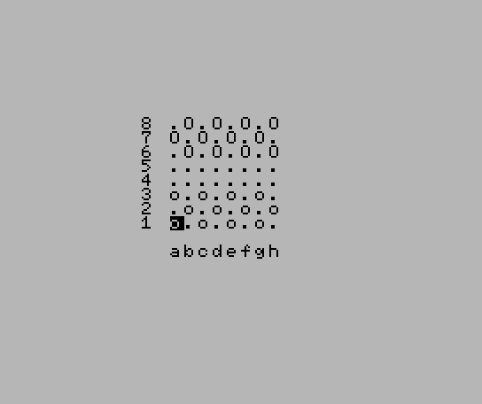

# Checker10L
Checker10L is an implementation in MSX2 BASIC of classic checker game: italian dama.
All classic rules are implemented: move, capture and promotion to king.



# Controls
- Cursor keys to move the cursor
- Space to select a piece
- Space to move the selected disc.

When a piece reaches the furthest row it becomes a king.

Sources are stored at: https://github.com/robertocapuano/Checker10L

# Installation
Game was developed in MSX-BASIC v3 on a MSX2+. Emulator is available at https://webmsx.org/
1. connect to https://webmsx.org
2. click on the first floppy icon below the blue screen
3. Select "Add Disk Images"
4. Choose "checker.dsk"
5. type in:
```
load "a:checker.bas"
run
```

WebMSX Launch URL:

- https://webmsx.org/?DISK=https://github.com/robertocapuano/Checker10L/raw/main/checker.dsk&BASIC_RUN=checker.bas

for a smoother effect use an accelerated clock:

- https://webmsx.org/?Z80_CLOCK_MODE=8&DISK=https://github.com/robertocapuano/Checker10L/raw/main/checker.dsk&BASIC_RUN=checker.bas

# Source Description

```
1 screen1,0,0:COLOR1,14,14:KEYOFF::DEFINTA-Z:B=6347:R=RND(-TIME):P(0)=46:P(1)=111:P(2)=79:P(5)=113:P(6)=81:B2=B+32*9:CLS:P1=0:P2=0:forJ=0to7:vpokeB-2+J*32,56-J:vpokeB2+J,97+J:forI=0to7:CK(I,J)=(1-(I+J)mod2)*(-1*(I<3)-2*(I>4)):nextI,J:
10 forJ=0to7:forI=0to7:vpoke B+32*(J)+I,P(CK(7-J,I)):nextI,J:gosub150:Q=(CK(R,C)and4):if (CK(R,C)and1)=0 then 10:else R0=R:C0=C:GOSUB150:if(R=R0+1or(Q=4 and R=R0-1))and abs(C0-C)=1 and CK(R,C)=0 then CK(R,C)=(CK(R0,C0)or(4*(-1*(R=7)))):CK(R0,C0)=0:goto60
20 CE=CK((R+R0)/2,(C+C0)/2):if(Q=0andR<>R0+2)orabs(R-R0)<>2orabs(C0-C)<>2orCK(R,C)<>0or(CE and2)<>2orQ<(CEand4)thenC=C0:R=R0:goto10:else:CK((R+R0)/2,(C+C0)/2)=0:CK(R,C)=(CK(R0,C0)or(4*(-1*(R=7)))):CK(R0,C0)=0:P1=P1+1:vpokeB2+95+P1,p(CE):beep:ifP1=12then1
60 AI=0:DU=RND(1)*7:DV=RND(1)*7:forJ=0to7:forI=0to7:vpoke B+32*(J)+I,P(CK(7-J,I)):nextI,J: forJ=0to7:U=(J+DU)mod8:forI=0to7:V=(I+DV)mod8:Q=CK(U,V)and4:forK=-1to1 step 2:forL=-1to(-(Q=4))step2: if(L=-1 and U<2) or (L=1andU>5) or (CK(U,V)and2)<>2 then70
65 D=-(V<2)++(V>5)+(V>1)*(V<6)*K:T=-(U<2)++(U>5)+(U>1)*(U<6)*L:CE=CK(U+T,V+D):if(CEand1)=1and Q>=(CEand4) and CK(U+2*T,V+2*D)=0 then CK(U+2*T,V+2*D)=(CK(U,V)or(4*(-1*((U+2*T)=0)))):CK(U,V)=0:CK(U+T,V+D)=0:I=7:J=7:K=1:AI=1:vpokeB-96+P2,p(1):P2=P2+1:beep
70 nextL,K,I,J:if P2=12 then 1 else if AI=1 then 10
71 S=SGN(RND(1)-.5):forJ=0to7:U=(J+DU)mod8:forI=0to7:V=(I+DV)mod8:Q=(CK(U,V)and4):forK=-StoS step S*2:forL=-StoSstep2*S: if (Q=0 and L=1) or (L=-1 and U=0) or (L=1 and U=7) or (CK(U,V)and2)<>2 then75:else D= -(V<1) + +(V>6) + (V>0) * (V<7)*K: T= L:
73 if CK(U+T,V+D)=0 then CK(U+T,V+D)=(CK(U,V)or(4*(-1*((U+T)=0)))):CK(U,V)=0:K=11: AI = 1: J=7:I=7:K=1:L=1
75 next L,K,I,J:if AI=0 then 1 :else10
150 LOCATE9+C,13-R:k$=INPUT$(1):K=ASC(K$):if K=32then return: else if K=30andr<7thenR=R+1:goto150:elseifK=31andR>0thenR=R-1:goto150:elseifK=28andC<7thenC=C+1:goto150;elseifK=29andC>0thenC=C-1:GOTO150:ELSE150
```
- Load Kun BASIC.
```
10 screen1,0,0:COLOR2,1,1:KEYOFF:CLS:DEFINTA-Z:B=base(5):R=RND(-TIME):R=4: BB=B+23*32:CB=BASE(6):
```
- screen1,0,0: Set text mode 32x24
- COLOR2,1,1: black color
- KEYOFF: hide function keys
- CLS: clear screen
- DEFINTA-Z: use integer variables
- B=base(5): base of framebuffer
- R=RND(-TIME): init random number generator
- R=4: BB=B+23*32:CB=BASE(6): constants used for base addresses

```
20  for i=0 to 4: READ R$:VPOKE  CB+8+I,VAL("&H"+R$) : next I
```
- load tile sets

```
100 _TURBOON(BB,R)
```
- enable turbo mode

```
105  S=32*24-1:for I=0 to S: vpoke BB+31-I, 64 : next I 
```
- scroll screen

```
110 for I=0 to 31: LL=R* (RND(1)* SIN(I/31 * 3.14)): vpoke BB+I,(8+LL)*8+LL : NEXT I
```
- generate random heat values and store them the last screen row

```
120 for J=0TO20:for I=0 to 31:A=BB-j*32+I:v= vpeek(a)mod8:d=RND(1)*3: AB=A - D +1 - 32: vpoke AB, (8+V)*8+V:NEXT I,J
```
- compute heat advection from bottom to top screen

```
150 K$=INKEY$:K=(K$<>""): R=-K*(4-R) + (1+K)*R:goto110:
```
- check key press, R is switched to stop/start generation of new heat values

```
160 _TURBOOFF
```
- end of turbo section
```
310 DATA 11, 88, 99,  ba, 98,   64, 73, 82, 91, 100

```
- tile map


CK(R,C) = 0 empty
CK(R,C) = 1 player
CK(R,C) = 2 opponent


 P(0)=46: empty
 P(1)=111 white
 P(2)=79 black


0 spazio
1 user
2 cpu
5 user
6 cpu


https://webmsx.org/?M=MSXTR

