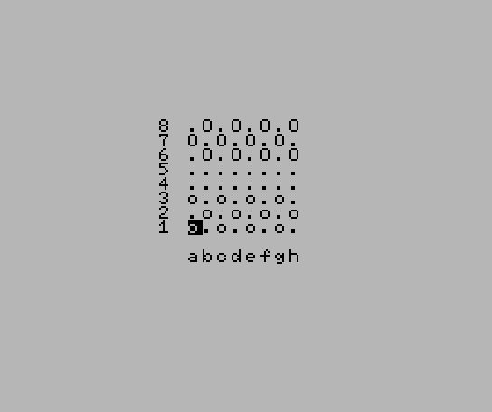

# Checker10L
Checker10L is an implementation in MSX2 BASIC of classic checker game: italian dama.
All classic rules are implemented: move, capture and promotion to king.



# Controls
- Cursor keys to move the cursor
- Space to select a piece
- Space to move the selected disc.

When a piece reaches the furthest row it becomes a king.

Sources are stored at: https://github.com/robertocapuano/Checker10L

# Installation
Game was developed in MSX-BASIC v3 on a MSX2+. Emulator is available at https://webmsx.org/
1. connect to https://webmsx.org
2. click on the first floppy icon below the blue screen
3. Select "Add Disk Images"
4. Choose "checker.dsk"
5. type in:
```
load "a:checker.bas"
run
```

WebMSX Launch URL:

- https://webmsx.org/?DISK=https://github.com/robertocapuano/Checker10L/raw/main/checker.dsk&BASIC_RUN=checker.bas

for a faster gameplay use an accelerated clock:

- https://webmsx.org/?Z80_CLOCK_MODE=8&DISK=https://github.com/robertocapuano/Checker10L/raw/main/checker.dsk&BASIC_RUN=checker.bas

# Source Description

```
1 screen1,0,0:COLOR1,14,14:KEYOFF::DEFINTA-Z:B=6348:R=RND(-TIME):P(0)=46:P(1)=111:P(2)=79:P(5)=113:P(6)=81:B2=B+32*9:CLS:P1=0:P2=0:forJ=0to7:vpokeB-2+J*32,56-J:vpokeB2+J,97+J:forI=0to7:CK(I,J)=(1-(I+J)mod2)*(-1*(I<3)-2*(I>4)):nextI,J:
```
- screen1,0,0: Set text mode 32x24
- COLOR1,14,14: black on grey
- KEYOFF: hide function keys
- CLS: clear screen
- DEFINTA-Z: use integer variables
- B=6347: base of framebuffer
- R=RND(-TIME): init random number generator
- P(0)=46:P(1)=111:P(2)=79:P(5)=113:P(6)=81 pieces ASCII codes
- B2=B+32*9 bottom of the board
- P1=0:P2=0: players points
- :forJ=0to7:vpokeB-2+J*32,56-J:vpokeB2+J,97+J:forI=0to7:CK(I,J)=(1-(I+J)mod2)*(-1*(I<3)-2*(I>4)):nextI,J: draw checkboard

```
10 forJ=0to7:forI=0to7:vpoke B+32*(J)+I,P(CK(7-J,I)):nextI,J:gosub150:Q=(CK(R,C)and4):if (CK(R,C)and1)=0 then 10:else R0=R:C0=C:GOSUB150:if(R=R0+1or(Q=4 and R=R0-1))and abs(C0-C)=1 and CK(R,C)=0 then CK(R,C)=(CK(R0,C0)or(4*(-1*(R=7)))):CK(R0,C0)=0:goto60
```
- forJ=0to7:forI=0to7:vpoke B+32*(J)+I,P(CK(7-J,I)):nextI,J draw pieces
- gosub150 read user input
- Q=(CK(R,C)and4): move user cursor
- if (CK(R,C)and1)=0 then 10: check if the cell contains an user piece
- R0=R:C0=C:GOSUB150: store starting position and read destination position of the piece
- if(R=R0+1or(Q=4 and R=R0-1))and abs(C0-C)=1 and CK(R,C)=0 check if is it a valid move
- CK(R,C)=(CK(R0,C0)or(4*(-1*(R=7)))):CK(R0,C0)=0:goto60 move the user piece
```
20 CE=CK((R+R0)/2,(C+C0)/2):if(Q=0andR<>R0+2)orabs(R-R0)<>2orabs(C0-C)<>2orCK(R,C)<>0or(CE and2)<>2orQ<(CEand4)thenC=C0:R=R0:goto10:else:CK((R+R0)/2,(C+C0)/2)=0:CK(R,C)=(CK(R0,C0)or(4*(-1*(R=7)))):CK(R0,C0)=0:P1=P1+1:vpokeB2+95+P1,p(CE):beep:ifP1=12then1
```
- CE=CK((R+R0)/2,(C+C0)/2): get cell at middle of the user move
- (Q=0andR<>R0+2) check if the user has made a simple move (1 cell)
- orabs(R-R0)<>2orabs(C0-C)<>2orCK(R,C)<>0or(CE and2)<>2orQ<(CEand4) check if the user capture the opponent piece
- C=C0:R=R0:goto10 in case the move is illegal restart user selection
- CK((R+R0)/2,(C+C0)/2)=0: a valid capture is made
- CK(R,C)=(CK(R0,C0)or(4*(-1*(R=7)))):CK(R0,C0)=0: piece is moved
- P1=P1+1:vpokeB2+95+P1,p(CE):beep: user points are increased
- ifP1=12then1 if user captured all 12 pieces the game restarts
 
```
60 AI=0:DU=RND(1)*7:DV=RND(1)*7:forJ=0to7:forI=0to7:vpoke B+32*(J)+I,P(CK(7-J,I)):nextI,J: forJ=0to7:U=(J+DU)mod8:forI=0to7:V=(I+DV)mod8:Q=CK(U,V)and4:forK=-1to1 step 2:forL=-1to(-(Q=4))step2: if(L=-1 and U<2) or (L=1andU>5) or (CK(U,V)and2)<>2 then70
```
- AI=0:DU=RND(1)*7:DV=RND(1)*7:forJ=0to7:forI=0to7:vpoke B+32*(J)+I,P(CK(7-J,I)):nextI,J: forJ=0to7:U=(J+DU)mod8:forI=0to7:V=(I+DV)mod8:Q=CK(U,V)and4:forK=-1to1 step 2:forL=-1to(-(Q=4))step2: if(L=-1 and U<2) or (L=1andU>5) or (CK(U,V)and2)<>2 then70

```
65 D=-(V<2)++(V>5)+(V>1)*(V<6)*K:T=-(U<2)++(U>5)+(U>1)*(U<6)*L:CE=CK(U+T,V+D):if(CEand1)=1and Q>=(CEand4) and CK(U+2*T,V+2*D)=0 then CK(U+2*T,V+2*D)=(CK(U,V)or(4*(-1*((U+2*T)=0)))):CK(U,V)=0:CK(U+T,V+D)=0:I=7:J=7:K=1:AI=1:vpokeB-96+P2,p(1):P2=P2+1:beep
```
D=-(V<2)++(V>5)+(V>1)*(V<6)*K:T=-(U<2)++(U>5)+(U>1)*(U<6)*L:CE=CK(U+T,V+D):if(CEand1)=1and Q>=(CEand4) and CK(U+2*T,V+2*D)=0 then CK(U+2*T,V+2*D)=(CK(U,V)or(4*(-1*((U+2*T)=0)))):CK(U,V)=0:CK(U+T,V+D)=0:I=7:J=7:K=1:AI=1:vpokeB-96+P2,p(1):P2=P2+1:beep
```
70 nextL,K,I,J:if P2=12 then 1 else if AI=1 then 10
```
- nextL,K,I,J:if P2=12 then 1 else if AI=1 then 10
```
71 S=SGN(RND(1)-.5):forJ=0to7:U=(J+DU)mod8:forI=0to7:V=(I+DV)mod8:Q=(CK(U,V)and4):forK=-StoS step S*2:forL=-StoSstep2*S: if (Q=0 and L=1) or (L=-1 and U=0) or (L=1 and U=7) or (CK(U,V)and2)<>2 then75:else D= -(V<1) + +(V>6) + (V>0) * (V<7)*K: T= L:
```
```
73 if CK(U+T,V+D)=0 then CK(U+T,V+D)=(CK(U,V)or(4*(-1*((U+T)=0)))):CK(U,V)=0:K=11: AI = 1: J=7:I=7:K=1:L=1
```
```
75 next L,K,I,J:if AI=0 then 1 :else10
```
```
150 LOCATE10+C,13-R:k$=INPUT$(1):K=ASC(K$):if K=32then return: else if K=30andr<7thenR=R+1:goto150:elseifK=31andR>0thenR=R-1:goto150:elseifK=28andC<7thenC=C+1:goto150;elseifK=29andC>0thenC=C-1:GOTO150:ELSE150
```

